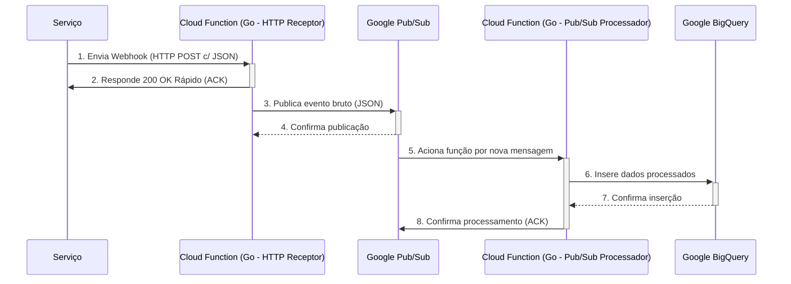

# Receptor de Webhooks (Google Cloud Functions com Go)

Este projeto simula um pipeline serverless no Google Cloud para receber, processar e, eventualmente, persistir eventos de webhooks enviados. Ele serve como um gateway robusto e escalável para lidar com as notificações.

## 🚀 Arquitetura do Projeto

O fluxo de dados segue a seguinte sequência, desenhado para resiliência e desacoplamento:



### Explicação do Fluxo:

1. **Serviço Envia Webhook**: A plataforma dispara uma requisição HTTP POST para um endpoint público.

2. **Cloud Function (HTTP Receptor)**: Uma função Go (pacote receiver) recebe o webhook. Sua única responsabilidade é validar o formato, responder rapidamente com um HTTP 200 OK e publicar o evento bruto no Pub/Sub. 

3. **Publicação no Pub/Sub**: A função HTTP publica o conteúdo bruto do webhook em um tópico do Google Pub/Sub, que atua como uma fila de mensagens durável e desacoplada.

4. **Cloud Function (Pub/Sub Processador)**: Uma segunda função Go (pacote processor) é acionada por novas mensagens no tópico. Esta função é responsável por analisar, formatar e inserir os dados no Google BigQuery.

5. **Google BigQuery**: O destino final dos dados. Uma tabela no BigQuery armazena os eventos para futuras análises.

## 💻 Como Rodar e Testar Localmente

Para desenvolver e testar sua função sem precisar implantá-la a cada alteração, usamos o funcframework do Google.

Pré-requisitos:
- Go (versão 1.24 ou superior)
- Google Cloud SDK (Emulador Pub/Sub)

1. **Inicie o Emulador do Pub/Sub**
Em um terminal separado, inicie o emulador:

```bash
gcloud beta emulators pubsub start
```

Ele irá expor um endpoint, geralmente localhost:8538. Exporte esta variável de ambiente:

```bash
export PUBSUB_EMULATOR_HOST=localhost:8538
```

2. **Configure e Rode as Funções**

Você precisará de dois terminais para rodar as duas funções simultaneamente.

**Terminal 1: Rode o Receptor HTTP**

```bash
# Define as variáveis para o receptor
export GCP_PROJECT_ID=your-local-project # Pode ser qualquer nome para o emulador
export PUBSUB_TOPIC_ID=webhooks-topic    # Nome do tópico a ser usado
export PORT=8080
export FUNCTION_TARGET=ReceiverFunction

# Rode a função a partir da raiz do projeto
go run .
```

**Terminal 2: Rode o Processador Pub/Sub**

```bash
# Define as variáveis para o processador
export GCP_PROJECT_ID=your-local-project
export BIGQUERY_DATASET_ID=your_dataset # Simulado, não conecta de fato
export BIGQUERY_TABLE_ID=your_table     # Simulado
export PORT=8081                        # Use uma porta diferente
export FUNCTION_TARGET=ProcessorFunction

# Rode a função
go run .
```

3. **Teste o Fluxo**
Agora, envie um webhook para o receptor HTTP (porta 8080):

```bash
curl -X POST \
  -H "Content-Type: application/json" \
  -d '{"eventType":"message.sent","timestamp":"2025-08-29T10:00:00Z","data":{"contactId":"123"}}' \
  http://localhost:8080
```

Você deverá ver os logs no Terminal 1 (recebendo e publicando) e, em seguida, no Terminal 2 (processando a mensagem do Pub/Sub).

## 🐳 Deploy no Google Cloud Functions

Com duas funções, o deploy precisa ser feito individualmente.

1. **Deploy do Receptor HTTP (ReceiverFunction)**

```bash
gcloud functions deploy go-receiver-http \
  --gen2 \
  --runtime=go1.22 \
  --region=southamerica-east1 \
  --source=. \
  --entry-point=ReceiverFunction \
  --trigger-http \
  --allow-unauthenticated \
  --set-env-vars=GCP_PROJECT_ID=SEU_PROJETO_ID,PUBSUB_TOPIC_ID=SEU_TOPICO_ID
```

2. **Deploy do Processador Pub/Sub (ProcessorFunction)**

```bash
gcloud functions deploy go-processor-pubsub \
  --gen2 \
  --runtime=go1.22 \
  --region=southamerica-east1 \
  --source=. \
  --entry-point=ProcessorFunction \
  --trigger-topic=SEU_TOPICO_ID \
  --set-env-vars=GCP_PROJECT_ID=SEU_PROJETO_ID,BIGQUERY_DATASET_ID=SEU_DATASET_ID,BIGQUERY_TABLE_ID=SUA_TABELA_ID
  ```

Importante: Lembre-se de substituir os valores SEU_..._ID pelos nomes reais dos seus recursos no GCP.

## 👩‍💻 Entendendo o Código Go (para Desenvolvedores Python com FastAPI)

A lógica agora está dividida em dois pacotes: receiver e processor.

`main.go` (Ponto de Entrada Local)

Este arquivo continua sendo o ponto de entrada para execução local. Ao importar os pacotes receiver e processor, suas respectivas funções `init()` são executadas, registrando `ReceiverFunction` e `ProcessorFunction` no framework. O `funcframework` então sabe qual função servir com base na variável de ambiente `FUNCTION_TARGET`.

```go
package main

import (
	"log"
	"os"

	"github.com/GoogleCloudPlatform/functions-framework-go/funcframework"

	// Importa ambos os pacotes para que suas funções sejam registradas
	_ "github.com/GuttoF/Go-Receiver-Example/processor"
	_ "github.com/GuttoF/Go-Receiver-Example/receiver"
)

func main() {
    // ... código para iniciar o funcframework ...
}
```

`receiver/function.go` (Receptor HTTP)
Esta função recebe a requisição HTTP e publica no Pub/Sub.

```go
// ... imports e inicialização do cliente Pub/Sub ...

func ReceiverFunction(w http.ResponseWriter, r *http.Request) {
    // 1. Valida o método HTTP
    // 2. Lê o corpo da requisição como bytes brutos
    // 3. Publica os bytes no Pub/Sub
    // 4. Responde 200 OK
}
```

Analogia Python (com FastAPI):

```python
# receiver/main.py
import os
from fastapi import FastAPI, Request, HTTPException
from google.cloud import pubsub_v1

app = FastAPI()
publisher = pubsub_v1.PublisherClient()
topic_path = publisher.topic_path(os.getenv("GCP_PROJECT_ID"), os.getenv("PUBSUB_TOPIC_ID"))

@app.post("/")
async def receiver_function(request: Request):
    if not request.headers.get("content-type") == "application/json":
        raise HTTPException(status_code=400, detail="Content-Type must be application/json")
    
    # 2. Lê o corpo como bytes brutos
    body_bytes = await request.body()
    
    try:
        # 3. Publica os bytes no Pub/Sub
        future = publisher.publish(topic_path, body_bytes)
        future.result()  # Aguarda a confirmação
    except Exception as e:
        raise HTTPException(status_code=500, detail=f"Failed to publish to Pub/Sub: {e}")

    # 4. Responde 200 OK
    return {"status": "sucesso"}
```

`processor/function.go` (Processador Pub/Sub)

Esta função é acionada pelo Pub/Sub e insere os dados no BigQuery.

```go
// ... imports e inicialização do cliente BigQuery ...

// A função aceita um CloudEvent como entrada
func ProcessorFunction(ctx context.Context, e cloudevents.Event) error {
    // 1. Extrai o payload da mensagem Pub/Sub de dentro do CloudEvent
    // 2. Decodifica o JSON do webhook
    // 3. Prepara a struct para o BigQuery
    // 4. Insere a linha no BigQuery
    return nil
}
```

Analogia Python (com Functions Framework):

```python
# processor/main.py
import os
import base64
import json
import functions_framework
from google.cloud import bigquery

# O decorator registra a função para ser acionada por um CloudEvent
@functions_framework.cloud_event
def processor_function(cloud_event):
    # 1. Extrai o payload da mensagem Pub/Sub de dentro do CloudEvent
    # O dado vem codificado em base64
    encoded_data = cloud_event.data["message"]["data"]
    decoded_data = base64.b64decode(encoded_data).decode("utf-8")
    
    try:
        # 2. Decodifica o JSON do webhook
        webhook_payload = json.loads(decoded_data)
    except json.JSONDecodeError:
        print("Error: Invalid JSON received")
        return  # Não tenta reenviar mensagem malformada

    # 3. Prepara o dicionário para o BigQuery
    row_to_insert = {
        "event_type": webhook_payload.get("eventType"),
        "event_timestamp": webhook_payload.get("timestamp"),
        "raw_data": json.dumps(webhook_payload.get("data", {}))
    }
    
    # 4. Insere a linha no BigQuery
    client = bigquery.Client()
    table_id = f"{os.getenv('GCP_PROJECT_ID')}.{os.getenv('BIGQUERY_DATASET_ID')}.{os.getenv('BIGQUERY_TABLE_ID')}"
    
    errors = client.insert_rows_json(table_id, [row_to_insert])
    if not errors:
        print(f"Successfully inserted event: {row_to_insert['event_type']}")
    else:
        print(f"Error inserting into BigQuery: {errors}")
        # Lançar uma exceção aqui faria o Pub/Sub tentar reenviar a mensagem
        raise RuntimeError(f"BigQuery insertion failed: {errors}")
```
