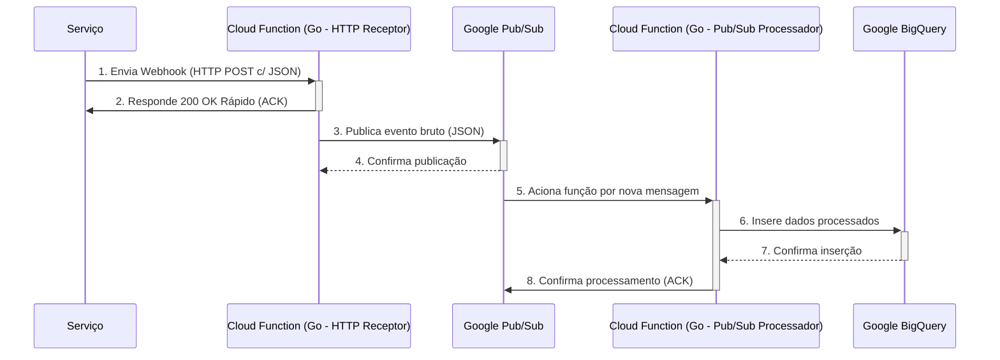

# Receptor de Webhooks (Google Cloud Functions com Go)

Este projeto simula um pipeline serverless no Google Cloud para receber, processar e, eventualmente, persistir eventos de webhooks enviados. Ele serve como um gateway robusto e escalável para lidar com as notificações.

## 🚀 Arquitetura do Projeto

O fluxo de dados segue a seguinte sequência, desenhado para resiliência e desacoplamento:



### Explicação do Fluxo:

1. **Serviço Envia Webhook**: A plataforma dispara uma requisição HTTP POST para um endpoint público.

2. **Cloud Function (HTTP Receptor)**: Uma função Go no Google Cloud Functions (acionada por HTTP) recebe o webhook. Sua única responsabilidade é validar o formato básico, logar o recebimento e, criticamente, responder rapidamente com um HTTP 200 OK para a Kinbox. Isso evita timeouts e reenvios.

3. **Publicação no Pub/Sub**: Após o recebimento, a função HTTP publica o conteúdo bruto do webhook em um tópico do Google Pub/Sub. Isso serve como uma fila de mensagens durável.

4. **Cloud Function (Pub/Sub Processador)**: Uma segunda função Go (acionada pelo Pub/Sub) consome essas mensagens da fila. Esta função é responsável por:

- Pegar a mensagem bruta.

- Analisar e extrair os dados relevantes.

- Formatar os dados conforme o esquema desejado.

- Inserir os dados formatados no Google BigQuery.

5. **Google BigQuery**: O destino final dos dados. Uma tabela no BigQuery armazena os eventos para futuras análises e processamento.

## 💻 Como Rodar e Testar Localmente

Para desenvolver e testar sua função sem precisar implantá-la a cada alteração, usamos o funcframework do Google.

Pré-requisitos:
Go (versão 1.24 ou superior)
Git

Passos:
**Clone o Repositório**:

```Bash
git clone [https://github.com/GuttoF/Go-Receiver-Example.git](https://github.com/GuttoF/Go-Receiver-Example.git)

cd Go-Receiver-Example
```

**Instale as Dependências**: O Go Modules fará isso automaticamente na primeira execução, mas você pode forçar:


```Bash
go mod tidy
```

**Defina as Variáveis de Ambiente**:

O funcframework usa PORT para definir a porta de escuta e FUNCTION_TARGET para saber qual função do seu código ele deve expor.

```Bash
export PORT=8080
export FUNCTION_TARGET=ReceiverFunction
```

**Execute o Servidor Local**: O main.go é o nosso ponto de entrada local.


```Bash
go run .
```

O terminal ficará bloqueado enquanto o servidor estiver ativo.

**Teste o Endpoint (em um novo terminal)**:

Abra um novo terminal (mantendo o anterior rodando o servidor) e envie um webhook de teste usando curl:

```Bash
curl -X POST \
  -H "Content-Type: application/json" \
  -d '{"eventType":"message.sent","timestamp":"2025-08-29T10:00:00Z","data":{"contactId":"123","message":"Olá, este é um teste!"}}' \
  http://localhost:8080
```

No terminal onde o servidor Go está rodando, você verá a saída dos logs:

```Bash
>>> Webhook recebido pela função em container!
Dados recebidos: map[data:map[contactId:123 message:Olá, este é um teste!] eventType:message.sent timestamp:2025-08-29T10:00:00Z]
```

## 🐳 Como Usar com Docker (para Teste Local e Deploy)

A forma recomendada de empacotar e implantar no Google Cloud Functions (especialmente a V2, via Cloud Run) é usando Docker.


**Pré-requisitos**:
Docker Desktop (Windows/macOS) ou Docker Engine (Linux)
Google Cloud SDK (gcloud) configurado e autenticado.

1. **Construir a Imagem Docker (para linux/amd64)**:
É crucial construir a imagem para a arquitetura do ambiente de nuvem (linux/amd64), mesmo que sua máquina local seja diferente (ex: Apple Silicon/ARM64). Usamos docker buildx para isso.

```Bash
docker buildx build --platform linux/amd64 --load -t go-receiver .
```

**--platform linux/amd64**: Garante a arquitetura correta para a nuvem.

**--load**: Carrega a imagem construída para o seu Docker local (essencial para docker run depois).

**-t go-receiver**: Tag para sua imagem.

2. **Testar a Imagem Docker Localmente**:
Após a construção, execute a imagem.

```Bash
docker run -p 8080:8080 -e PORT=8080 -e FUNCTION_TARGET=ReceiverFunction go-receiver
```

**-p 8080:8080**: Mapeia a porta do host para a porta do container.

**-e PORT=8080**: Define a porta de escuta dentro do container.

**-e FUNCTION_TARGET=ReceiverFunction**: Informa qual função deve ser servida.

Envie um curl como no teste local para http://localhost:8080.

3. **Fazer Deploy no Google Cloud Functions (via Cloud Run)**:
O gcloud pode construir e implantar sua imagem automaticamente no Google Cloud Functions.

```Bash
gcloud run deploy go-receiver-service \
  --source . \
  --platform managed \
  --region southamerica-east1 \
  --allow-unauthenticated \
  --entry-point ReceiverFunction
go-receiver-service: Nome do seu serviço.
```

**--source .**: Indica que o código-fonte está no diretório atual (o Dockerfile será usado).

**--platform managed**: Para usar a plataforma totalmente gerenciada do Cloud Run.

**--region southamerica-east1**: Escolha sua região (ex: São Paulo).

**--allow-unauthenticated**: Permite que o endpoint seja acessado publicamente.

**--entry-point ReceiverFunction**: Crucial para Cloud Functions, especifica qual função Go deve ser o ponto de entrada.

## 👩‍💻 Entendendo o Código Go (para Desenvolvedores Python com FastAPI)

**go.mod**
Este arquivo é como o pyproject.toml ou requirements.txt do Go. Ele define o nome do seu módulo (o projeto em si) e lista as dependências externas.

```Go
module [github.com/GuttoF/Go-Receiver-Example](https://github.com/GuttoF/Go-Receiver-Example) // Identidade do seu projeto
go 1.24 // Versão mínima do Go

require [github.com/GoogleCloudPlatform/functions-framework-go](https://github.com/GoogleCloudPlatform/functions-framework-go) v1.8.1 // Dependência
```

Analogia Python:

```TOML
# pyproject.toml
[project]
name = "Go-Receiver-Example"
version = "0.1.0"
requires-python = ">=3.9"
dependencies = [
    "functions-framework==3.4.0" # Exemplo, não é a mesma lib
]
```

**main.go**
Este é o ponto de entrada principal do seu aplicativo quando executado localmente. Ele usa o funcframework para simular o ambiente do Google Cloud Functions. Ele não contém a lógica do seu webhook, apenas a inicialização do servidor.

```Go
package main // Este arquivo é o executável principal

import (
	"log" // Para logs (como o módulo `logging` do Python)
	"os"  // Para interagir com o sistema operacional (como `os` do Python)

	"[github.com/GoogleCloudPlatform/functions-framework-go/funcframework](https://github.com/GoogleCloudPlatform/functions-framework-go/funcframework)" // A biblioteca para rodar funções localmente

	_ "[github.com/GuttoF/Go-Receiver-Example/receiver](https://github.com/GuttoF/Go-Receiver-Example/receiver)" // Importa o pacote "receiver" do nosso próprio projeto.
	// O `_` significa que não usaremos nada diretamente deste pacote, mas queremos que seu `init()` seja executado.
)

func main() { // A função `main` é o ponto de partida do programa
	port := os.Getenv("PORT") // Lê a variável de ambiente PORT (como `os.environ.get('PORT')`)
	if port == "" {
		port = "8080" // Valor padrão se a variável não estiver definida
	}

	// Inicia o servidor HTTP que vai escutar na porta especificada.
	// Ele vai procurar por funções registradas (como a nossa ReceiverFunction).
	if err := funcframework.Start(port); err != nil { // Tratamento de erro (análogo a `try...except`)
		log.Fatalf("funcframework.Start: %v\n", err) // Loga um erro fatal e encerra (como `raise SystemExit(...)`)
	}
}
```

Analogia Python:

```Python
# run_local.py
import os
import uvicorn
# `app` seria a instância FastAPI definida em your_project/receiver.py
from your_project.receiver import app

if __name__ == "__main__":
    port = int(os.environ.get("PORT", 8080))
    # No Go, o "funcframework.Start" magicamente encontra nossa função registrada.
    # Em Python/FastAPI, iniciaríamos o servidor Uvicorn assim:
    uvicorn.run(app, host="0.0.0.0", port=port)
```

**receiver/function.go**
Este arquivo contém a lógica de negócio real do nosso webhook.

```Go
package receiver // Define o nome do pacote (análogo a um módulo Python)

import (
	"encoding/json" // Módulo para lidar com JSON (como `json` em Python)
	"log"
	"net/http" // Módulo para lidar com HTTP (como o request/response do Starlette/FastAPI)

	"[github.com/GoogleCloudPlatform/functions-framework-go/functions](https://github.com/GoogleCloudPlatform/functions-framework-go/functions)"
)

// init() é uma função especial em Go. Ela é executada automaticamente quando o pacote é importado.
// Usamos para registrar nossa função de webhook com o framework.
func init() {
	functions.HTTP("ReceiverFunction", ReceiverFunction)
}

// ReceiverFunction é a nossa função principal.
// `w http.ResponseWriter` é um objeto para escrever a resposta.
// `r *http.Request` é o objeto da requisição, contendo headers, corpo, etc.
func ReceiverFunction(w http.ResponseWriter, r *http.Request) {
	// Garante que a requisição é do tipo POST
	if r.Method != http.MethodPost {
		http.Error(w, "Método não permitido.", http.StatusMethodNotAllowed)
		return // `return` aqui funciona como um `return` para encerrar a execução da função
	}
	log.Println(">>> Webhook recebido!")

	var data map[string]interface{} // Declara uma variável `data` do tipo `map`, análogo a um `dict` em Python.

	// Decodifica o corpo da requisição JSON para dentro da nossa variável `data`.
	if err := json.NewDecoder(r.Body).Decode(&data); err != nil { // Tratamento de erro
		http.Error(w, "Corpo do JSON inválido.", http.StatusBadRequest)
		return
	}

	log.Printf("Dados recebidos: %+v", data)

	// Prepara e envia a resposta de sucesso.
	w.Header().Set("Content-Type", "application/json") // Define o header da resposta
	w.WriteHeader(http.StatusOK) // Define o status code 200 (Opcional, pois é o padrão)
	json.NewEncoder(w).Encode(map[string]string{"status": "sucesso"}) // Codifica um map/dict para JSON e envia na resposta.
}
```

Analogia Python:

```Python
# your_project/receiver.py
import logging
from fastapi import FastAPI, Request, HTTPException
from pydantic import BaseModel, Field
from typing import Any, Dict

# O registro da função é feito criando uma instância do FastAPI
app = FastAPI()

# Usando Pydantic para validação automática (muito idiomático em FastAPI)
class WebhookPayload(BaseModel):
    event_type: str = Field(..., alias="eventType")
    timestamp: str
    data: Dict[str, Any]

# O decorador de rota define o caminho e o método (POST)
@app.post("/")
async def receiver_function(payload: WebhookPayload):
    # O FastAPI já valida o método (POST) e o corpo da requisição com o Pydantic.
    # Se o JSON for inválido, o FastAPI retorna um erro 422 automaticamente.
    logging.info(">>> Webhook recebido!")

    # O payload já vem decodificado e validado como um objeto Pydantic
    logging.info(f"Dados recebidos: {payload.model_dump_json(indent=2)}")

    # Prepara e envia a resposta de sucesso. FastAPI converte dicts para JSON.
    return {"status": "sucesso"}
```